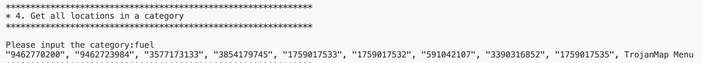

<center><h3>EE 538 - Computing Principles for Electrical Engineers</h3></center>

<center><h1>Trojan Map Report</h1></center>

<center><h3>Team Member: Yuhui Wu(USC ID:6466358591)  Junfei Huang(USC ID:8035067981)</h3></center>

# Overview
The Trojan Map project is a comprehensive tool designed to model, analyze, and solve geographic problems in a localized area, using advanced algorithms for data retrieval, pathfinding, and optimization. The project provides functionality for analyzing a map’s geographic data, performing path planning, and solving related computational problems like the Traveling Salesperson Problem (TSP).

# Member Functions & Variables
| Name                                             | Description                                                  |
| ------------------------------------------------ | ------------------------------------------------------------ |
| **Phase 1**                                      |                                                              |
| [.Autocomplete](#autocomplete)                   | Complete the location name given a half-word                 |
| [.GetLat](#getlat])                              | Return the latitude of a location                            |
| [.GetLon](#getlon])                              | Return the longtitude of a location                          |
| [.GetName](#getname)                             | Return the name of a location                                |
| [.GetID](#getid)                                 | Return the unique identification of a location               |
| [.GetNeighborIDs](#getneighborids)               | Return neighbors of a location                               |
| [.GetPosition](#getposition)                     | Return the coordinate of a location                          |
| [.CalculateEditDistance](#calculateeditdistance) | Calculate a the shortest edit distance of two strings        |
| [.FindClosestName](#findclosestname)             | Find out the cloest name matched with the given one          |
| **Phase 2**                                      |                                                              |
| [.GetAllCategories](#getallcategories)           | Return all available categories                              |
| [.GetAllLocationsFromCategory](#getalllocations) | Return all locations that match that category                |
| [.GetLocationRegex](#getlocationregax)           | Return all location ids that match the regular expression    |
| [.CalculateShortestPath_Bellman_Ford](#bellman)  | Given two location, return its shortest path using bellman algorithm |
| [.CalculateShortestPath_Dijkstra](#dijkstra)     | Given two location, return its shortest path using dijkstra  algorithm |
| [.CycleDetection](#cycledetection)               | Check  if there is a cycle path in the subgraph              |
| [.DeliveringTrojan](#topo)                       | Sort the nodes in the order of topological                   |
| **Phase 3**                                      |                                                              |
| [.TravellingTrojan_Brute_force](#bruteforce)     | Given a set of nodes, return the solution for TSP problems   |
| [.TravellingTrojan_Backtracking](#backtracking)  | Given a set of nodes, return the solution for TSP problems optimized by DP and BT |
| [.TravellingTrojan_2opt](#2opt)                  | Return a heuristic solution for TSP problems                 |
| [.FindNearby](#findnearby)                       | Given a radius and search the location nearby                |
| [.TrojanPath](#trojanpath)                       | Find the shortest path to visit all the locations            |
| [.Queries](#queries)                             | Check connectivity with gas tank constraints using Union-Find|

# Detailed Implimentation
## Phase 1
### 1. Autocomplete
<div id="autocomplete"></div>

```c++
std::vector<std::string> Autocomplete(std::string name);
```

**Time complexity:** O(m*n) where n is the number of nodes in the map and m is the average length of node names

**Steps:**
1. Iterate over data
2. Convert strings to lowercase
3. Substring comparison

**Output:**


### 2. Find the location
### 2-1. Get Position
<div id="getposition"></div>

```c++
std::pair<double, double> GetPosition(std::string name);
```
**Time complexity:** O(m*n) where n is the number of nodes in the map and m is the average length of node names

**Steps:**
1. Initialize the result
2. Iterate over the map
3. Compare the node name
- For each node, the name field of the current node (iter->second.name) is compared with the input string (name)
4. Return the results

### 2-2. Calculate Edit Distance
<div id="calculateeditdistance"></div>

```c++
int CalculateEditDistance(std::string name1, std::string name2);
```
**Time complexity:** O(m*n) where n is the number of nodes in the map and m is the average length of node names

**Steps:**
1. Initialization
- Create a 2D matrix dp of size (m+1) * (n+1) to store the edit distance for each substring combination
2. Base Case Setup
- Fill the first row of the matrix: If i=0, the cost is j 
- Fill the first column of the matrix: If j=0, the cost is i
3. Recursive Case
- If a[i-1] == b[j-1], copy the value from dp[i-1][j-1] (no cost)
- Otherwise, calculate the minimum cost among:
    - Delete a character: dp[i-1][j] + 1
    - Insert a character: dp[i][j-1] + 1
    - Replace a character: dp[i-1][j-1] + 1
4. Return the result

**Example table for inputs "ralphs" and "rolphs"**
|      | Base Case  | r   | o   | l   | p   | h   | s   |
|:----:|:----------:|:---:|:---:|:---:|:---:|:---:|:---:|
|      | 0          | 1   | 2   | 3   | 4   | 5   | 6   |
|  r   | 1          | 0   | 1   | 2   | 3   | 4   | 5   |
|  a   | 2          | 1   | 1   | 2   | 3   | 4   | 5   |
|  l   | 3          | 2   | 2   | 1   | 2   | 3   | 4   |
|  p   | 4          | 3   | 3   | 2   | 1   | 2   | 3   |
|  h   | 5          | 4   | 4   | 3   | 2   | 1   | 2   |
|  s   | 6          | 5   | 5   | 4   | 3   | 2   | 1   |

**Output:**
| Output | Map |
| :---: | :---: |
|  | 

## Phase 2
### 3. Find all location categories
<div id="getallcategories"></div>

```c++
std::vector<std::string> GetAllCategories();
```
**Time Complexity:** O(N*M+K*logK), where N is the number of locations, M is the average number of categories per location and K is the total number of unique categories

**Steps:**
1. Input dataset traversal
2. Unique categories extraction
3. Conversion to vector
4. Sorting
5. Return the result

**Output:**


### 4. Get all Locations of a Category
<div id="getalllocations"></div>

```c++
std::vector<std::string> GetAllLocationsFromCategory(std::string category);
```
**Time complexity:** O(N*M*L), where N is number of nodes, M is average number of attributes per node and L is average length of attribude string

**Steps:**
1. Convert input category to lowercase
2. Iterate through dataset
3. Match attributes case-insensitively
4. Return ids of locations matched with the category

**Output:**
| Output | Map |
| :---: | :---: |
|  | 

### 5. Get locations matching regular expression
<div id="getlocationregax"></div>

```c++
std::vector<std::string> GetLocationRegex(std::regex location);
```
**Time complexity:** O(N*L), where N is number of nodes and L is average length of attribude string

**Steps:**
1. Validation of the regular expression
2. Dataset iteration
3. Regex matching
- Checks if the location’s name matches the given regular expression
- If a match is found, the location’s id is added to the result vector
4. Return the result vector containing the IDs of locations whose names matched the regular expression

**Output:**


### 6. Calculate Shortest Path
### 6.1. Dijkstra's Algorithm
<div id="dijkstra"></div>

```c++
std::vector<std::string> CalculateShortestPath_Dijkstra(std::string &location1_name,
                                               std::string &location2_name);
```
**Time complexity:** O((N+E)*logN), where N is the number of nodes and E is the number of edges

**Steps:**
1. Initialization
- Distances are set to infinity
- A priority queue is used to store nodes and their current known distances
2. Processing
- For the node with the smallest distance (top of the queue), its neighbors are “relaxed”
3. Termination
- When the end node is processed, the shortest path has been determined
- Starting from the target node, backtrack using the parent map to reconstruct the path
### 6.2. Bellman Ford Algorithm
<div id="bellman"></div>

```c++
std::vector<std::string> CalculateShortestPath_Bellman_Ford(std::string &location1_name,
                                               std::string &location2_name);
```
**Time complexity:**
- Bellman Ford: O(N*E), where N is the number of nodes and E is the number of edges
- Bellman Ford Optimized: O(k*E), k<=n-1, where E is the number of edges

**Steps:**
1. Initialization
- Distances are initialized to infinity, except for the start node
2. Edge Relaxation
3. Early Termination
- If no updates occur during an iteration, the algorithm terminates early
4. Path Reconstruction
- Backtrack from the target node using the parent map

**Output:**
| Output | Map |
| :---: | :---: |
|  | 

### 7. Cycle Detection​
<div id="cycledetection"></div>

```c++
bool CycleDetection(std::vector<double> &square);
```
**Time complexity:** O(n * e), where n is the number of nodes in the subgraph and e is the average number of neighbors per node.

**Steps:**
1. Build Adjacency List
- Iterate through all nodes in the subgraph.
- For each node id, retrieve its neighbors using data[id].neighbors.
- Check if each neighbor lies within the square using the inSquare(neighbor, square) function.
- Add valid neighbors to the adjacency list adj
2. DFS Function
- Define a recursive function dfs(node, parent, dfs_ref) to explore the graph:
    - Mark the node as visited using visited.insert(node).
    - Iterate through all neighbors of the node in adj[node]:
        -Skip the parent node to avoid revisiting the edge that led to this node.
        - If a neighbor is already visited or leads to a cycle, return true.
    - Return false if no cycle is found.
3. Cycle Detection
- For each unvisited node in the subgraph:
    - Call the dfs(node, "", dfs) function to check for cycles.
    - If a cycle is detected, output the cycle path and return true.
4. Return Result
- Return true if a cycle is found; otherwise, return false.

**Examples:**
| Nodes in Subgraph | Edges in Subgraph | Square Coordinates (left, right, upper, lower) | Cycle Detected | Runtime (ms) |
|:-----------------:|:-----------------:|:----------------------------------------------:|:--------------:|:------------:|
| 462               | 537               | (-118.254, -118.204, 34.0762, 34.0262)        | true           | 2            |
| 7751              | 9303              | (-118.294, -118.244, 34.0724, 34.0224)        | true           | 46           |
| 28                | 21                | (-118.248, -118.198, 34.0779, 34.0279)        | false          | 0            |
| 4036              | 4907              | (-118.27, -118.22, 34.0596, 34.0096)          | true           | 25           |
| 2933              | 3572              | (-118.269, -118.219, 34.0698, 34.0198)        | true           | 17           |
| 3                 | 2                 | (-118.286, -118.236, 34.0951, 34.0451)        | false          | 0            |
| 5694              | 6838              | (-118.283, -118.233, 34.0735, 34.0235)        | true           | 33           |

**Output:**
| Output | Map |
| :---: | :---: |
|  | 

### 8. Topological Sort​
<div id="topo"></div>

```c++
std::vector<std::string> DeliveringTrojan(std::vector<std::string> &location_names,
                                            std::vector<std::vector<std::string>> &dependencies);
```
**Time complexity:** O(n + m), where n is the number of locations and m is the number of dependencies.

**Steps:**
1. Graph Initialization
- Create an adjacency list graph to represent the directed graph.
- Initialize an in_degree map where each location has an in-degree of 0.
- For each location, set its adjacency list as empty and its in-degree as 0
2. Graph Construction
- For each dependency, the graph and in-degree map are updated:
    - Add an edge from dependency[0] (source) to dependency[1] (target) in the graph.
    - Increment the in-degree of the target node.
3. Find Zero In-Degree Nodes
- Find all nodes with zero in-degree and add them to a queue.
- While the queue is not empty:
    - Dequeue a node, add it to the result, and process its neighbors.
    - Decrement the in-degree of each neighbor. If it becomes zero, enqueue the neighbor.
4. Cycle Detection
- If the result does not include all nodes, a cycle exists. Return an empty vector.
5. Return Result
- Return the sorted order of nodes if a valid topological sort exists.

**Examples:**
| Number of Nodes | Number of Dependencies | Runtime (ms) | Result                                                                                     |
|:---------------:|:----------------------:|:------------:|:------------------------------------------------------------------------------------------:|
| 5               | 4                      | 0.025417     | Stimson House -> Missionette Christian Academy -> Grand & 39th -> 23rd & Figueroa 1 -> Bevvy |
| 9               | 21                     | 0            | No valid topological sort (cycle detected) |
| 10              | 27                     | 0.108084     | Washington & Mariposa -> Felix Chevrolet -> Martin Luther King Junior & Broadway 1 -> Hoover & 24th -> Studio 423 -> Exposition & Normandie -> Just Ride LA -> Hill & 12th -> Washington & Broadway -> North Star Auditorium |
| 5               | 7                      | 0.035416     | City Tacos -> Hoover & 32nd -> Vermont Elementary School -> Vernon Branch Los Angeles Public Library -> Henderson Community Center |
| 6               | 9                      | 0            | No valid topological sort (cycle detected) |
| 8               | 12                     | 0.051917     | Exposition & Halldale 1 -> Chevron 2 -> Adams & Arlington -> Figueroa & Adams -> USC Parking -> Vermont & 24th -> Twentyfirst Street Temple Church of God in Christ -> Eileen L Norris Cinema Theatre |
| 7               | 11                     | 0.049375     | Figueroa Street & 23rd Street -> Western & Adams -> Pico & Hill -> Traveler -> Amazon Hub Locker -> Fruit and Candy -> Travelers Fountain |

**Output:**


## Phase 3
### 9. Traveling salesman problem
### 9.1. Brute-force (i.e. generating all permutations, and returning the minimum)
<div id="bruteforce"></div>

```c++
std::pair<double, std::vector<std::vector<std::string>>> TravelingTrojan_Brute_force(
      std::vector<std::string> location_ids);
```
**Time complexity:** O(n!), where n is the number of locations.
### 9.2. Brute-force enhanced with early backtracking
<div id="backtracking"></div>

```c++
std::pair<double, std::vector<std::vector<std::string>>> TravelingTrojan_Backtracking(
      std::vector<std::string> location_ids);
```
**Time complexity:** O(n!) in the worst case, but backtracking prunes invalid paths, making it faster than plain brute force for most inputs.
### 9.3. 2-opt Heuristic
<div id="2opt"></div>

```c++
std::pair<double, std::vector<std::vector<std::string>>> TravelingTrojan_2opt(
      std::vector<std::string> location_ids);
```
**Time complexity:** O(k*n^2), where k is the number of iterations until no further improvements are possible, and n is the number of locations.

**Steps (Applicable for All three Algorithms):**
1. Input Validation
- Ensure all input locations exist in the map.
- Handle edge cases for single or empty nodes.
2. Path Initialization
- For brute force: Generate all permutations.
- For backtracking: Use recursive exploration.
- For 2-opt: Start with a greedy path.
3. Path Calculation
- Calculate the distance for each path using CalculatePathLength.
4. Optimization:
- Brute force: Compare all permutations.
- Backtracking: Prune invalid paths based on the current distance.
- 2-opt: Refine the path by reversing segments and re-evaluating the total distance.
5. Output Results
- Return the shortest path and its distance.

**Comparsion**
| Number of Locations | Brute Force (ms) | Backtracking (ms) | 2-opt Heuristic (ms) |
|:-------------------:|:----------------:|:-----------------:|:--------------------:|
| 3                   | 0.067833        | 0.037042          | 0.037416             |
| 4                   | 0.139667        | 0.097125          | 0.112083             |
| 5                   | 0.4745          | 0.441875          | 0.175667             |
| 6                   | 2.82138         | 1.69637           | 0.515875             |
| 7                   | 18.8785         | 7.83967           | 1.19663              |
| 8                   | 130.709         | 33.4908           | 0.643875             |
| 9                   | 1074.9          | 216.496           | 2.93054              |
| 10                  | 10668.9         | 1180.71           | 3.15054              |

**Output:**
| Output | Map |
| :---: | :---: |
|  | 

### 10. Find Nearby
<div id="findnearby"></div>

```c++
std::vector<std::string> TrojanMap::FindNearby(std::string attributesName, std::string name, double r, int k);
```
**Time complexity:** O(nlogn), where n is the number of nodes in the map.

**Steps:**
1. Get Starting Location
- Use the GetID function to retrieve the ID of the starting location by its name.
- If the location is not found, return an empty vector.
2. Iterate Over All Nodes
- For each node in the map:
    - Skip the starting location and nodes that do not match the specified attribute.
    - Use the CalculateDistance function to compute the Euclidean distance between the starting node and the current node.
    - If the calculated distance is less than or equal to the specified radius r, add the node to the list of valid locations.
3. Sort by Distance
- Sort the valid locations by their distances in ascending order.
4. Collect Top Results
- Return the top k closest locations or fewer if fewer than k valid locations exist.
5. Return Results
- Return the vector of IDs for the top k closest locations.

**Output:**
| Output | Map |
| :---: | :---: |
|  | 

### 11. Find Path to Visit All Places
<div id="trojanpath"></div>

```c++
std::vector<std::string> TrojanMap::TrojanPath(std::vector<std::string> &location_names)
```
**Time complexity:**  O(n² * d), where n is the number of locations and d is the complexity of CalculateShortestPath_Dijkstra (finding the shortest path between two nodes). And d = O((V + E) log V).

**Steps:**
1. Input Validation
- If the input list location_names is empty, return an empty vector.
2. Mapping Names to IDs
- Use the GetID function to map each location name to its unique ID.
- Validate each location name. If any name is invalid, return an empty vector.
3. Sorting Nodes
- Sort the mapped IDs to establish a consistent starting point.
4. Initialize Greedy TSP:
- Select the first location in the sorted list as the starting point.
- Mark the starting location as visited and add it to the path.
5. Iterative Path Construction
- While there are unvisited locations:
    - Iterate over all unvisited locations to find the nearest one using CalculateShortestPath_Dijkstra.
    - Calculate the distance using CalculatePathLength.
    - Select the location with the minimum distance and update the path.
6. Merge Paths
- Avoid duplicate nodes by removing the starting node from intermediate paths.
5. Return the Shortest Path

**Output:**


### 12. Check Exist of Path with Constrain​
<div id="queries"></div>

```c++
std::vector<bool> Queries(const std::vector<std::pair<double, std::vector<std::string>>> &q);
```
**Time complexity:** O(|E|log|E|+|Q|*|V|) where |E| is the number of edges in the graph, |Q| is the number of queries and |V| is the number of nodes in the graph.

**Steps:**
1. Extract Edges
- Iterate over each node and its neighbors to extract unique edges with their distances.
2. Sort Edges
- Sort edges in ascending order based on distance.
3. Process Each Query
- Translate the source and destination names to IDs using the GetID function.
- Initialize a Union-Find data structure for all nodes.
- Add edges to the Union-Find structure if their distance is within the tank capacity.
- Use Union-Find to check if the source and destination are connected.
4. Return Results
- Store the results (true/false) for each query in a vector and return it.

**Examples:**
| **Tank Capacity (gallons)** | **Query Example (Source - Destination)**                      | **Result** | **Time (ms)** |
|:---------------------------:|:-------------------------------------------------------------:|:----------:|:-------------:|
| 6.80421                     | 11th & Maple - 11th & Santee                                  | true       | 208.019       |
| 0.595003                    | Washington & Union 2 - Western & 10 Off-ramp                  | true       | 212.206       |
| 0.353029                    | Adams & Grand - Hecuba Queen of Troy                          | false      | 201.745       |
| 19.7479                     | Normandie & 36th 1 - Grand & 14th                             | true       | 233.136       |
| 9.38119                     | Figueroa & Exposition - Adams Normandie Historic District     | true       | 202.415       |
| 0.565006                    | Jefferson & Normandie - Best Donuts                           | false      | 204.948       |
| 9.38119                     | Figueroa & Exposition - Adams Normandie Historic District     | true       | 202.415       |
| 4.94633                     | Vermont & Washington - Exposition & Trousdale 1               | true       | 203.867       |
| 13.5455                     | Smoke Shop - Popeyes                                          | true       | 203.548       |

**Output:**


## Extra Credit 
### 3-opt
```c++
std::pair<double, std::vector<std::vector<std::string>>> TrojanMap::TravelingTrojan_3opt(
      std::vector<std::string> location_ids);
```
**Time complexity:** O(n^3 * k), where n is the number of locations and k is the maximum number of iterations, controlled by max_iterations.

**Steps:**
1. Input Validation
- Check if the input vector is empty. If yes, return a result with zero distance and an empty path.
- Handle the base case of a single location by returning a path of length 0.
2. Initialize Path
- Create an initial path as a closed loop (returning to the start node).
- Calculate and record the initial path length.
3. 3-opt Optimization
- Initialize an improvement flag to true and set a maximum iteration count.
- While improvements are found and the iteration count is below the maximum:
    - Iterate over all triplets of nodes (i, j, k) in the path.
    - Generate four new paths by reversing segments based on the 3-opt algorithm.
    - Ensure the new paths are closed loops by appending the start node if missing.
    - Calculate the distance of each new path and compare it with the current best path.
    - Update the best path and distance if a better path is found, and set the improvement flag to true.
4. Return Results
- Store the final best path and distance in the result.
- Return the shortest path found and its corresponding distance.

**Comparsion**
| Number of Locations | 3-opt Runtime (ms) |
|:-------------------:|:------------------:|
| 3                   | 0.05975            |
| 4                   | 0.228625           |
| 5                   | 1.53704            |
| 6                   | 3.55354            |
| 7                   | 7.20237            |
| 8                   | 11.1657            |
| 9                   | 16.923             |
| 10                  | 26.7845            |


### Genetic Algorithm
```c++
std::vector<std::string> TrojanMap::GenerateRandomPath(const std::vector<std::string> &nodes);
```
**Time complexity:** O(g*p*(n^2+nlogp)) where g is the number of generations, p is the population size and n is the number of nodes(locations).

**Steps:**
1. Input Validation and Initialization
- Convert location names to their corresponding IDs using GetID.
- Initialize the population with p random paths using the std::shuffle function.
- Track the best solution with std::numeric_limits<double>::max() for the shortest path.
2. Fitness Evaluation
- Compute the distance for each path in the population using CalculatePathLength.
- Store each path and its corresponding distance as a pair in fitness_population.
3. Selection
- Sort the fitness_population by distance in ascending order.
- Select the top 50% of the population as parents for the next generation.
4. Crossover
- Generate offspring by combining parts of two parent paths using the Crossover function.
- Add offspring paths to the new population until its size matches the original population size.
5. Mutation
- Randomly mutate some paths in the population based on the mutation rate using the MutatePath function.
- Swap two random locations in the path to introduce diversity.
6. Loop Through Generations
- Repeat steps 2–5 for g generations.
- Continuously track and update the shortest path discovered.
7. Form a Cycle
- Ensure the best path forms a cycle by adding the starting location to the end of the path.
- Return the Result
8. Return the shortest distance and the corresponding path.

# Conclusion
The Trojan Map project provided a robust framework to simulate and solve complex routing and navigation problems in a realistic geographic setting. The following objectives were successfully achieved:
- Pathfinding Algorithms: Implemented Dijkstra’s and Bellman-Ford algorithms for shortest path computations.
- Optimization Techniques: Used genetic algorithms and local optimization methods like 2-opt and 3-opt for solving the Traveling Salesman Problem (TSP).
- Location Queries: Implemented search functionalities such as autocomplete, regex matching, and location categorization.
- Cycle Detection: Enabled efficient detection of cycles within a subgraph, demonstrating practical graph analysis.
- Subgraph Operations: Provided tools to work on geographically constrained areas of the map.

# Lessons Learned
**1. Algorithm Design**
- Greedy algorithms (e.g., 2-opt for TSP) provide a balance between computational cost and solution quality.
- Genetic algorithms are versatile but require careful parameter tuning (e.g., population size, mutation rate) to converge effectively.

**2. Data Structures**
- Efficient data structures such as priority queues, hash maps, and disjoint sets are critical for scalable solutions.
- Graph representations (adjacency lists) are essential for managing relationships between nodes.

**3. Real-World Constraints**
- Handling real-world datasets highlighted the need for error checking (e.g., invalid IDs or empty inputs) and robustness in the implementation.